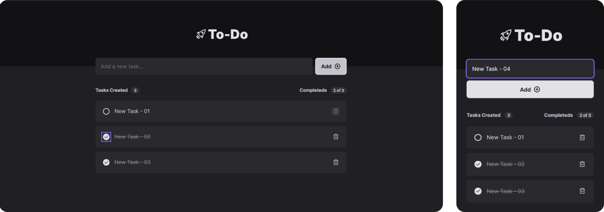
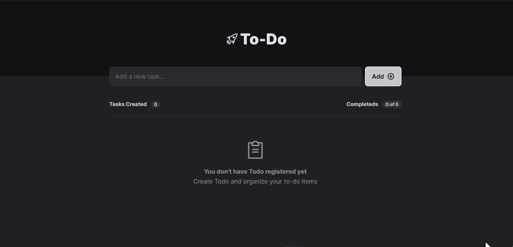
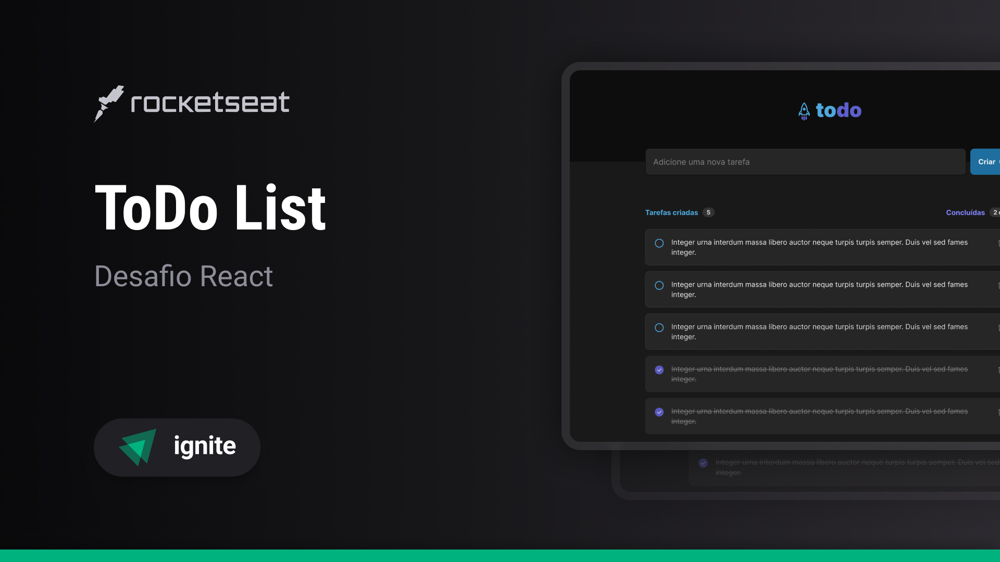

<h1 align="center">
  
</h1>

<div align="center">
  <a href="#📸-project-view">📸 Project View</a> -
  <a href="#ℹ-about-the-project">ℹ About the Project</a> -
  <a href="#🏗-main-features">🏗 Main Features</a> -
  <a href="#⚙️-technologies">⚙️ Technologies</a> -
  <a href="#🧪-test-the-project---click-on-the-button">🧪 Test the Project</a> -
  <a href="#🎨-layout">🎨 Layout</a> -
  <a href="#💻-repository-cloning">💻 Repository Cloning</a> -
  <a href="#🤝-contributions">🤝 Contributions</a> -
  <a href="#👨‍💻-author">👨‍💻 Author</a>
</div>

## 📸 Project View

<div align="center">
  
  
</div>

## ℹ About the Project

<p>
  During some free time I had, I decided to create a to-do list application to practice my programming skills. The project was simple but meaningful to me. As I began the project, I delved into the logic behind organizing and manipulating task lists. I learned the importance of a well-defined data structure to store task information and the efficient way to access them as needed.
</p>

## 🏗 Main Features

- [x] Add a new task

- [x] Mark and unmark a task as completed

- [x] Remove a task from the listing

## ⚙️ Technologies

- <a href="https://vitejs.dev/"> Vite</a>
- <a href="https://react.dev/"> React JS</a>
- <a href="https://www.typescriptlang.org/"> TypeScript</a>

## 🧪 Test the Project - Click on the button

<a href="https://todo-list-eight-eosin.vercel.app/">
  
</a>

## 🎨 Layout

<a align="center" href="https://www.figma.com/file/0n0zDN7zbzhRbaEO74Xesx/ToDo-List">
  
</a>

## 💻 Repository Cloning

1. **Requirements:** Make sure you have the following software installed on your system:

- <a href="https://git-scm.com/"> GIT</a>
- <a href="https://nodejs.org/"> Node JS</a>

2. **Clone the Repository:** Make a clone of this repository to your development environment using the following command:

```bash
git clone https://github.com/HenriqueFerraz27/todo-list.git
```

3. **Dependency Installation:** Navigate to the project folder and install the necessary dependencies with the following command:

```bash
npm install # or yarn install
```

4. **Server Run:** Start the development server with the following command:

```bash
npm run dev # or yarn dev
```

5. **Application Access:** Open your browser and access the link provided to use Todo List.

## 🤝 Contributions

If you would like to contribute to the project, please follow the contribution guidelines below:

1. Fork the repository on GitHub.

2. Create a new branch for your contribution:

```bash
git checkout -b feature/your-contribution
```

3. Make any necessary changes, and test them to ensure that the changes are robust and reliable.

4. Submit your changes with a pull request (PR).

5. After review and approval, your changes will be incorporated into the project.

## 👨‍💻 Author

<a href="https://github.com/HenriqueFerraz27">

</a>
<br>

🌌 Building connections across the code universe, [Henrique Frraz](https://www.linkedin.com/in/henriqueferraz277) 🚀
